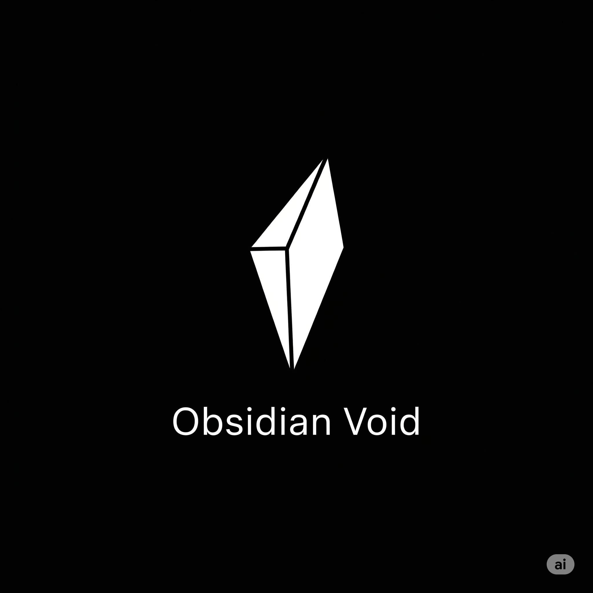

<h1>
  
  Obsidian Void - Development Guide
</h1>

Welcome to the development guide for **Obsidian Void**. This document is your personal quickstart for testing, modifying, and publishing your theme.

Remember the core philosophy: **focus and simplicity**.

---

## 📁 Project Structure

This folder contains all the necessary files for your color theme. The two most important files are:

* **`package.json`**: This is the heart of your extension (the manifest file). It defines metadata like the theme's name, publisher, and points to the theme definition file.
* **`themes/obsidian-void-color-theme.json`**: This is where the magic happens. All your UI colors (`colors`) and syntax highlighting rules (`tokenColors`) are defined in this file.

---

## ⚙️ Development Workflow

Your theme comes with a pre-configured workflow to make testing easy and fast.

1.  **Start Debugging**: Press `F5` in VS Code.
2.  **New Window Opens**: A new "Extension Development Host" window will appear. This window has your **Obsidian Void** theme loaded as an active extension.
3.  **Activate Your Theme**: If not already active, use `Ctrl+K Ctrl+T` to open the theme picker and select "Obsidian Void".
4.  **Live Reload**: Open the `themes/obsidian-void-color-theme.json` file in your main editor. Make any color change and save the file. The changes will be applied **instantly** in the Extension Development Host window. No reload needed!

### 🎨 Finding the Right Scope to Color

To create a great theme, you need to know *what* to color. The "Inspect Editor Tokens and Scopes" tool is your best friend.

1.  In the **Extension Development Host** window, open any code file (e.g., a `.js`, `.py`, or `.css` file).
2.  Press `Ctrl+Shift+P` to open the Command Palette.
3.  Run the **`Developer: Inspect Editor Tokens and Scopes`** command.
4.  Click on any piece of code (a keyword, variable, string, etc.).
5.  An info box will appear, showing you the exact `scope` for that token (e.g., `keyword.control.js`). You can then use this scope in the `tokenColors` section of your `.json` file to assign it a color.

---

## 🌍 Publishing Your Theme

Ready to share **Obsidian Void** with the world? The process is straightforward.

1.  **Install `vsce`**: If you haven't already, install the Visual Studio Code Extension manager globally:
    ```bash
    npm install -g @vscode/vsce
    ```
2.  **Package Your Extension**: This will create a `.vsix` file, which is your packaged extension.
    ```bash
    vsce package
    ```
3.  **Publish**: To publish, you first need a publisher account on the VS Code Marketplace. Once set up, you can publish your theme.
    ```bash
    vsce publish
    ```

> For detailed, one-time setup instructions (like creating a publisher), refer to the official [Publishing Extensions](https://code.visualstudio.com/api/working-with-extensions/publishing-extension) documentation.

---

**Happy coding!**